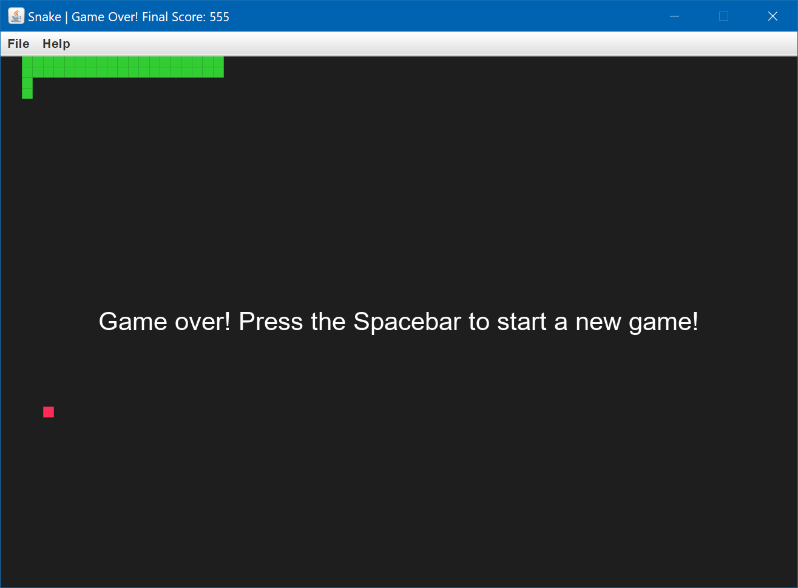

# Snake 🐍

This is a snake game programmed in Java. The code for this game was written using an object-oriented programming approach and the UI was created using [Swing](https://en.wikipedia.org/wiki/Swing_(Java)) components.

## How to Play

The goal of the game is to navigate the snake's head to the food piece on the game map. Every time a food is eaten by the snake, the score is increased by `15` points. Additionally, the snake grows one unit longer and also a new food piece is generated at a random coordinate where the snake is not located. Beware though! If the snake's head goes out of bounds or intersects with its body then it's game over.

The controls for the game are:

| Key(s)                       | Action                                           |
| ---------------------------- | ------------------------------------------------ |
| <kbd>↑</kbd> or <kbd>W</kbd> | Changes the snake's movement direction to up.    |
| <kbd>←</kbd> or <kbd>A</kbd> | Changes the snake's movement direction to left.  |
| <kbd>↓</kbd> or <kbd>S</kbd> | Changes the snake's movement direction to down.  |
| <kbd>→</kbd> or <kbd>D</kbd> | Changes the snake's movement direction to right. |
| <kbd>Spacebar</kbd>          | Starts the game if it hasn't been started yet.   |
| <kbd>P</kbd>                 | Pauses/unpauses the game.                        |       

## Screenshots

